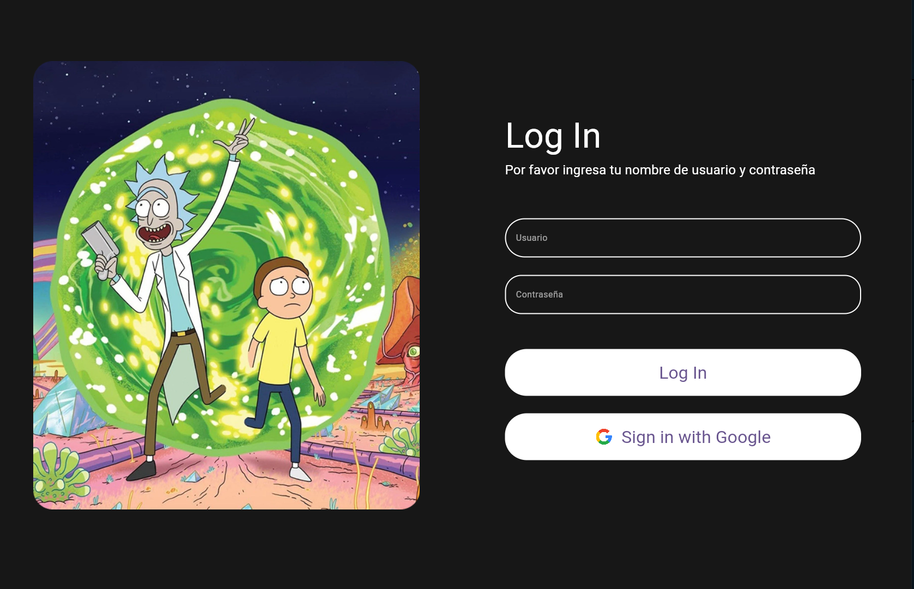
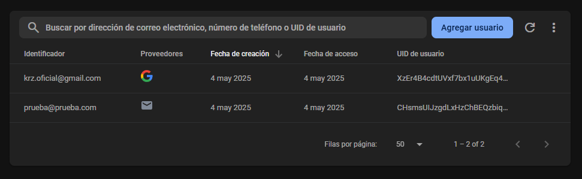

# Rcik and Morty Flutter App

## Requerimentos
| Herramienta        | Version  | 
| ------------- |:-------------:| 
| Flutter     | 3.29 | 
| Dart    | 3.7.0     |  


## URL

### https://oscar-cr.github.io/rick_flutter_web/ 

## Pasos para ejecutar
Clonar el proyecto
```
git clone https://github.com/Oscar-CR/RickAndMorty_FlutterWeb.git
```

Instalar dependencias
```
flutter pub get
```

Ejecutar proyecto
```
//Elejir la opcion web (normalmente opcion 2)

flutter run
```


## Firebase



Se creo un usuario de prueba para probar el funcionamiento de firebase
correo:
```
prueba@prueba.com
```
contraseña:
```
prueba
```
Adicional se puede acceder con google o ejecutar la funcion para crear un usuario